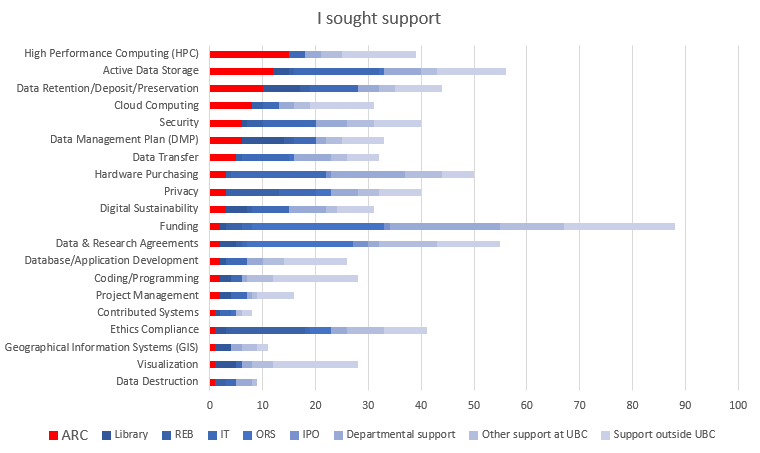
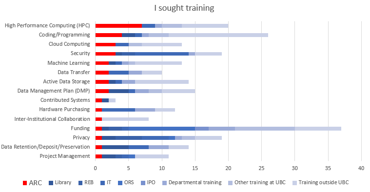
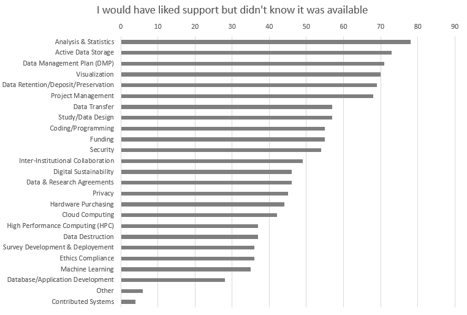
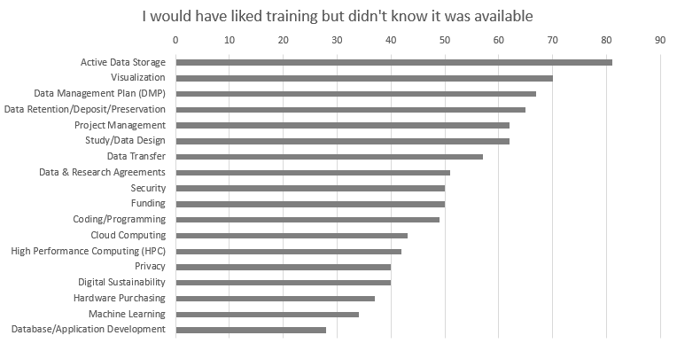

## Executive Summary

Situated within the Office of the Vice-President of Research and Innovation (VPRI), UBC Advanced Research Computing (ARC) supports the high-performance computing (HPC) and data management needs of researchers across all UBC campuses and affiliated hospitals and institutions.  With team members having a wide variety of technical and research backgrounds, and whom actively sit on and support a number of national teams and services, ARC facilitates training, support, and access to a broad range of local and national digital research infrastructure. 

ARC occupies a unique position at the intersection of HPC, research data management (RDM), and research software (RS), and leverages this position through collaborating with many departments and portfolios across UBC to offer support and training across a wide range of DRI activities queried in this needs assessment.   

## Definitions

**Training** Single workshops, workshop series, online modules/videos, and formal courses

**Support** Web resources, consultations, advising, troubleshooting, and recommendations

### Key Findings & Recommendations

**Finding 1:**  While ARC is a key player in active data storage and data retention/deposit/preservation at UBC, these were top areas in which researchers wanted both training and support, but didn’t know they were available;

**Recommendation 1:**  As UBC Library and IT are also leaders in both these areas, coordinate services across these units to maximize efforts, resources, and discoverability of services;
 
 
**Finding 2:**  ARC sits as a close second behind UBC Library as a leader in DMP support and training at UBC, and this is an area in which a vast majority of respondents wanted both training and support, but didn’t know they were available;

**Recommendation 2:**  Coordinate DMP and other RDM services with the Library to maximize efforts, resources, and discoverability of services;

**Finding 3:**  Coding/programming is a top area in which researchers are seeking training from ARC, but 85% of researchers are still seeking training elsewhere (with the majority going outside UBC).  There were also several comments in the survey indicating that introductory ARC training is too difficult for beginners;

**Recommendation 3:**  Look for partners within UBC to determine training and support that is feasible to offer internally, and what is acceptable to refer to externally.  Leverage partnerships to build a coding/programming curriculum, beginning with the very basic and leading to HPC training, as a way to build a larger base of researchers who are capable of utilizing ARC resources and conducting world-class research.    

### Top Reasons People Come to ARC

_Top 3 areas in which **researchers sought support from ARC** (Figure X for full details)_

1. High-Performance Computing: 38% of researchers who sought support went to ARC
2. Active Data Storage: 21% of researchers who sought support went to ARC
3. Data Retention/Deposit/Preservation: 23% of researchers who sought support went to ARC

_Top 3 areas in which **researchers sought training from ARC** (Figure X for full details)_

1. High-Performance Computing: 35% of researchers who sought training went to ARC
2. Coding/Programming:  15% of researches who sought training went to ARC
3. Cloud Computing:  23% of researches who sought training went to ARC

## Highlights

## Survey Comments

_“Sometimes the ARC training is very technical and unapproachable for students new to stats and HPC.”_

_“I attended some intro sessions last summer, but it was still too big of a jump from using a personal desktop to Sockeye or Compute Canada resources.”_

_“Please make more comprehensive resources for beginners working with the ARC Sockeye cluster!"_

_“It was hard to know where to start, especially when working with many non-UBC partners who could not access UBC or Compute Canada systems easily”_

