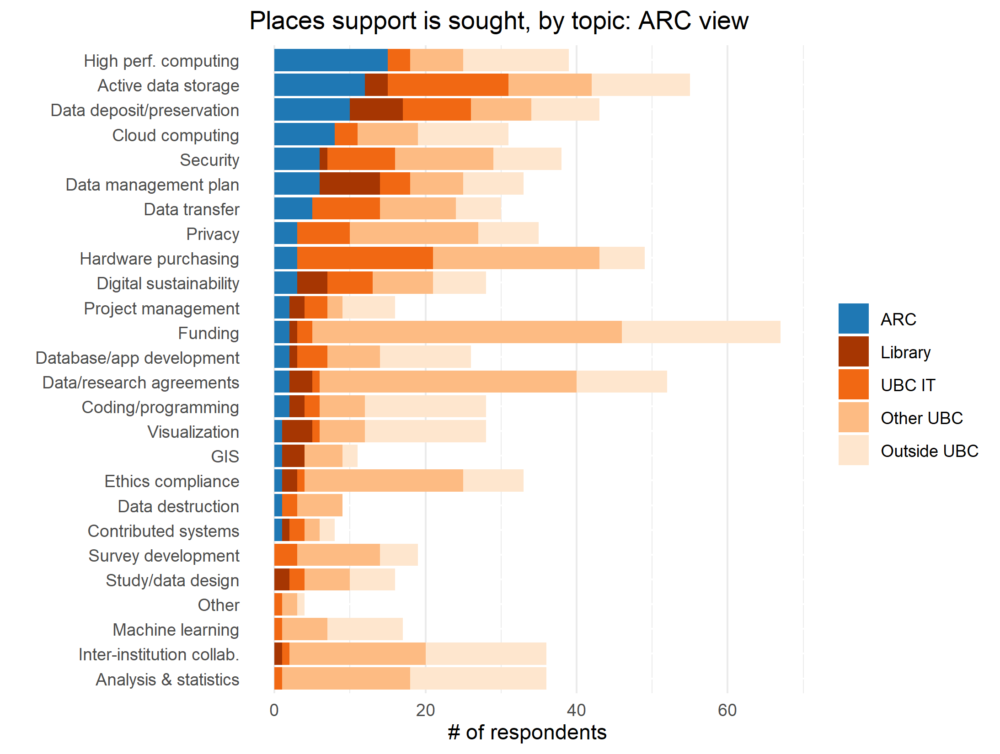
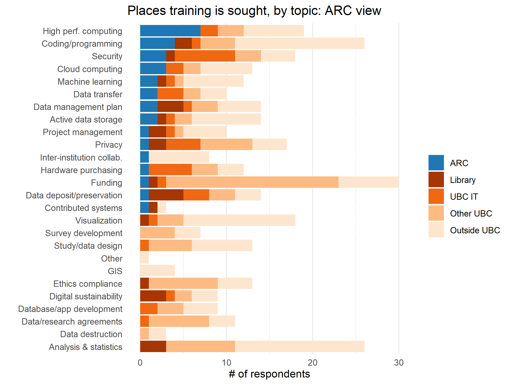

Situated within the Office of the Vice-President of Research and Innovation (VPRI), UBC Advanced Research Computing (ARC) supports the high-performance computing (HPC) and data management needs of researchers across all UBC campuses and affiliated hospitals and institutions.  With a wide variety of technical and research expertise, and staff who actively sit on and support a number of national teams and services, ARC facilitates training, support, and access to a broad range of local and national digital research infrastructure.

ARC occupies a unique position at the intersection of high performance computing (HPC), research data management (RDM), and research software (RS), and leverages this position through collaboration with departments and portfolios across UBC to offer support and training across the range of DRI activities queried in this needs assessment.      

## Key Findings & Recommendations

  <b>Finding 1</b> 
   
Coding/programming is a top area in which researchers are seeking training from ARC, but 85% of researchers are still seeking training elsewhere (with the majority going outside UBC).  Additionally, several comments in the survey indicated that introductory ARC training is too advanced for beginners.
  
  
  

 <b>Recommendation 1</b>
  
Identify partners within UBC to determine training and support that is feasible to offer, and what external training can be endorsed and communicated.  Leverage partnerships to build a coding/programming curriculum, beginning with the very basic and leading to HPC training, as a way to build a larger base of researchers who are capable of effectively utilizing ARC resources and conducting world-class research. 

 
 

  <b>Finding 2</b> 
   
ARC sits as a close second behind UBC Library as a leader in DMP support and training, and this is an area in which a vast majority of respondents wanted both training and support, but didn’t know they were available.
 
  
  

  <b>Recommendation 2</b> 
   
 Coordinate DMP and other RDM services with the Library to maximize efforts, resources, and discoverability of services.

  <b>Finding 3</b> 
   
While ARC is a key player in servicing active data storage and data retention/deposit/preservation at UBC, these were top areas in which researchers wanted both training and support, but didn’t know they were available.
 
  
  

 <b>Recommendation 3</b>
   
 As UBC Library and UBC IT are also leaders in both these areas, coordinate services across these units to maximize efforts, resources, and discoverability of services.

## Highlights

### DRI Support & UBC ARC

1. High-Performance Computing: 38% of researchers who sought support went to ARC
2. Active Data Storage: 21% of researchers who sought support went to ARC
3. Data Retention/Deposit/Preservation: 23% of researchers who sought support went to ARC

**Figure 2.1**

### DRI Training & UBC ARC

1. High-Performance Computing: 35% of researchers who sought training went to ARC
2. Coding/Programming:  15% of researches who sought training went to ARC
3. Cloud Computing:  23% of researches who sought training went to ARC

**Figure 2.2**

**Figure 2.3.  Survey Quotes Regarding ARC Training**

> “Sometimes the ARC training is very technical and unapproachable for students new to stats and HPC.”

> “I attended some intro sessions last summer, but it was still too big of a jump from using a personal desktop to Sockeye or Compute Canada resources.”

> “Please make more comprehensive resources for beginners working with the ARC Sockeye cluster!”

## Discussion

**Training Partnerships**

UBC Library provides graduate level training and faculty support in DRI-related topics such as digital scholarship, GIS, RDM, and data analysis. In addition to this training, Compute Canada offers a great deal of computational and HPC training offerings. Noting that current introductory ARC training was identified as being too challenging for beginners, and that UBC researchers are seeking training both internally at UBC and externally from the institution, there is an opportunity to more closely collaborate with these two groups, as well as others, to build a more comprehensive and seamless trajectory in DRI training, beginning with basic skills and working up to advanced HPC competencies.   

**Research Networks**

As discussed in the focus groups, there is huge benefit in graduate students (both in similar disciplines and across disciplines) having a venue to build research networks as a way to foster peer-training and collaborative research endeavours.  In addition to partnering with other departments to offer more comprehensive training, there is also an opportunity to collaborate with UBC Graduate Studies on both campuses, as well as UBC Postdoctoral Association, to explore how we might leverage training initiatives to begin building a platform to encourage and support these networks. 

**Communications** 

Despite ARC’s best efforts to communicate its services to the UBC research community, many researchers report wanting these services but remaining unaware of them.  In focus groups, many people reported that they hear about DRI services from domain specific communication channels, as well as word-of-mouth from those in their department or research circles. An interesting finding from the survey is the large number of respondents from Medicine and Health Sciences, and the Social Sciences and Humanities compared to other disciplines, and whether this is reflective of more effective communications to these communities. A review of communication strategies and complementary communication strategies by units supporting DRI activities on both campuses would enhance awareness of institutional supports for DRI. 

## Next Steps

UBC ARC plays a prominent role in DRI services, from HPC and large data storage infrastructure, to data management and sensitive data support and training.  Building effective communication strategies and collaborations depends on working relationships between employees, faculty, graduate students, and researchers. However, without executive support to provide guidance and coordination across units and departments any successes remain rooted in individual commitments and approaches. UBC ARC stands to support a more robust, integrated DRI service offering if these efforts are provided the needed guidance, coordination, and funding.

In line with main report, further information gathering is required to address many of the issues highlighted in this survey. Addressing communication challenges would benefit from richer data from participants on information gathering preferences, a key strength UBC ARC could contribute to future collective efforts. UBC ARC could also play a central role in formalizing a data collection strategy to inform future intra-institutional collaboration on DRI supports and training.

