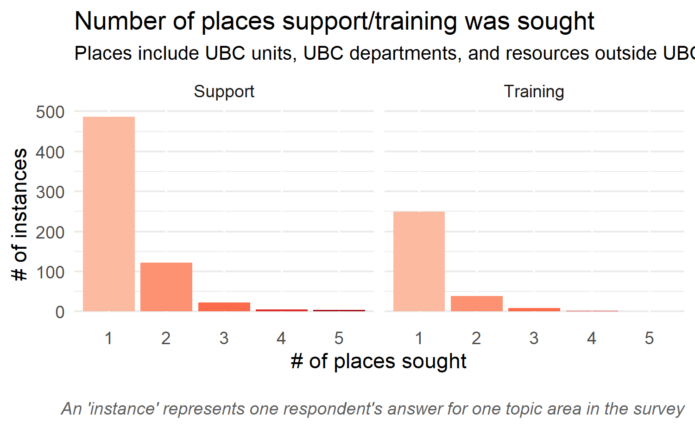

## Executive Summary

Digital Research Infrastructure (DRI) refers to a suite of services that enables the collection, processing, dissemination and disposition of research data. This includes strategies for planning, organizing, storing, sharing, computing, and ultimately archiving or destroying one’s research data.

From May 17th - June 12, 2021, UBC Advanced Research Computing (ARC) and the UBC Library from both Vancouver and Okanagan Campuses launched the DRI Needs Assessment Survey to investigate UBC researchers’ needs in 25 distinct areas relating to DRI (see full details of survey [insert link]), receiving 241 total responses.  Following the survey, three focus groups were conducted with UBC researchers to gain additional insights in these areas.

The buttons below link to subreports tailored to the corresponding portfolio.

  <a href="arc.html">ARC</a>

  <a href="library.html">Library</a>

 

  <a href="ors.html">ORS</a>

  <a href="it.html">IT</a>

## Definitions

**Training** Single workshops, workshop series, online modules/videos, and formal courses

**Support** Web resources, consultations, advising, troubleshooting, and recommendations

## Key Findings & Recommendations

**Finding 1**: A significant portion of respondents who reported wanting training and support didn't know they were available.

**Recommendation 1**: **Coordinate and strategize communications** across portfolios and departments to ensure that researchers are able to easily find and access services.

**Finding 2**:

## Reports

The 25 areas of DRI queried have been split into 4 individual reports, detailing if supports and training were needed and where they were sought. Each report is catered to a specific unit and represents core areas of service delivery within each of those units. 

### Full Report

## Introduction

