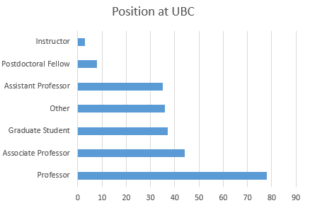
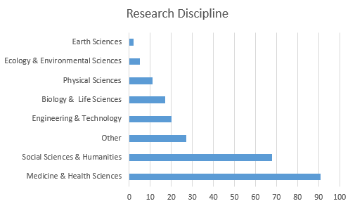
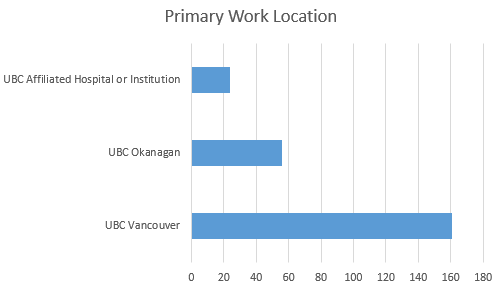
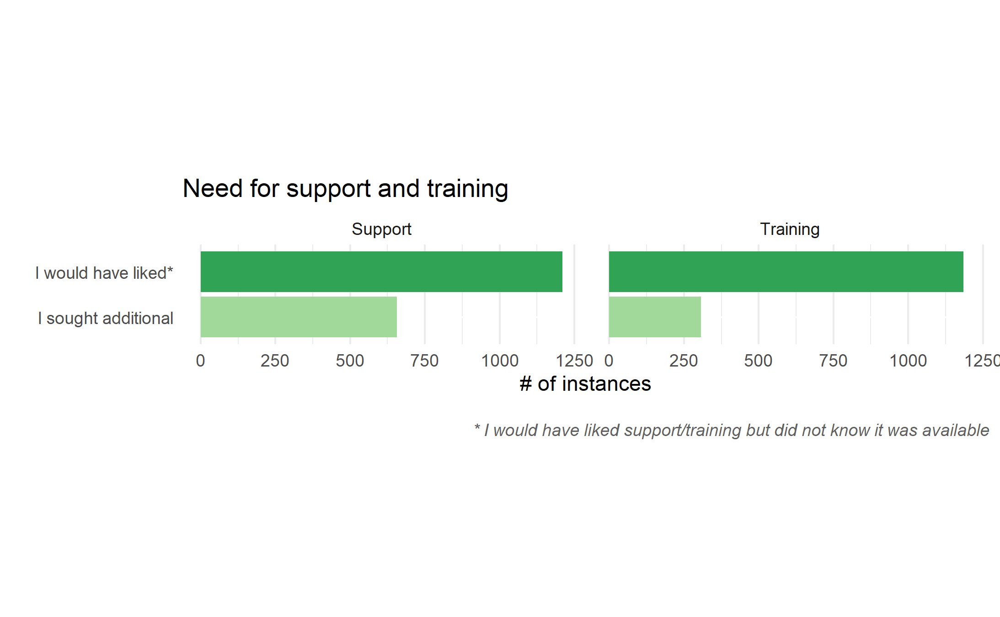
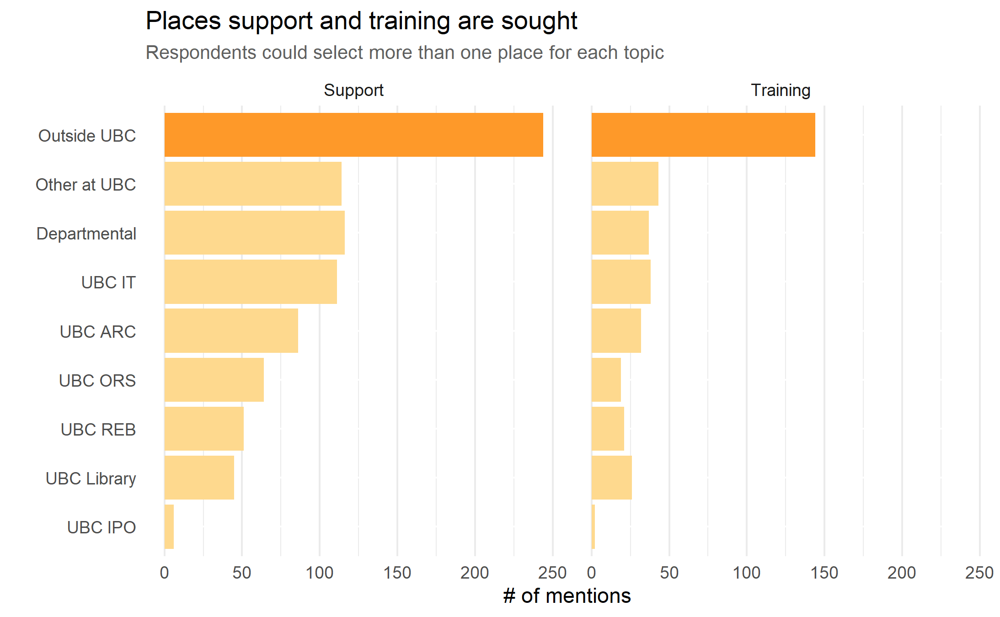

- TOC
{:toc}

---

## Executive Summary

Digital Research Infrastructure (DRI) refers to a suite of services that enables the collection, processing, dissemination and disposition of research data. This includes strategies for planning, organizing, storing, sharing, computing, and ultimately archiving or destroying one’s research data.

From May 17th - June 12, 2021, UBC Advanced Research Computing (ARC) and the UBC Library from both Vancouver and Okanagan Campuses launched the DRI Needs Assessment Survey to investigate UBC researchers’ needs in 25 distinct areas relating to DRI (see full details of survey [insert link]), receiving 241 total responses.  Following the survey, three focus groups were conducted with UBC researchers to gain additional insights in these areas.

Key findings from the survey indicate a need for increased collaboration among units providing DRI training and support, and an enhanced communication strategy to engage researchers with DRI campus training and supports. 

The buttons below link to subreports tailored to the corresponding portfolio.

  <a href="arc.html">ARC</a>

  <a href="library.html">Library</a>

 

  <a href="ors.html">ORS</a>

  <a href="it.html">IT</a>

## Definitions

**Training** Single workshops, workshop series, online modules/videos, and formal courses

**Support** Web resources, consultations, advising, troubleshooting, and recommendations

## Key Findings & Recommendations

**Finding 1**:  For every element of DRI investigated, training and support were sought across multiple portfolios and departments, as well as outside of UBC;

**Recommendation 1**: Coordinate services with portfolios and departments that offer similar services to maximize efforts and reduce duplication;

**Finding 2**: Respondents overwhelmingly reported wanting training and support but not knowing they were available;

**Recommendation 2**: Coordinate and strategize communications across portfolios and departments to ensure that researchers are able to easily find and access services;

**Finding 3**: Participants in focus groups noted that finding the right service is challenging; 

**Recommendation 3**: Coordinate across portfolios and departments that provide DRI services to build a central portal for the easy discovery of services.

## Reports

The 25 areas of DRI queried have been split into 4 individual reports, detailing if supports and training were needed and where they were sought. Each report is catered to a specific unit and represents core areas of service delivery within each of those units. 

## **Full Report**

### **Introduction**

**Background**

Digital Research Infrastructure (DRI) refers to a suite of services that enables the collection, processing, dissemination and disposition of research data. This includes strategies for planning, organizing, storing, sharing, computing, and ultimately archiving or destroying one's research data. 

As traditionally non-computational disciplines increasingly rely on digital methodologies or approaches, and computationally-centric disciplines need to navigate increasingly large and complex computational environments, there is a growing and wide spread need to support the infrastructural needs of these research projects as well as to ensure that practitioners have the skillsets required to engage in these activities. 

**Context of National DRI**

The newly formed Digital Research Alliance of Canada (The Alliance) represents a momentous integration of High-Performance Computing (HPC), Research Data Management (RDM), and Research Software (RS) on a national scale.   As this organization aims to develop synergies and collaboration across these historically separate and disconnected services, there is an opportunity for the University of British Columbia (UBC) to align itself with this national vision, and to become a Canadian and sector leader in DRI services.   

**Research Data Management (RDM) Requirements**

 In line with the recently released Tri-Agency Research Data Management Policy, all Tri-Agency eligible institutions are required to create a public RDM Institutional Strategy by March 1, 2023. 

RDM requires knowledge of and services to support the creation, processing, dissemination, and disposition of data. This includes legal and ethical considerations, software and hardware expertise, communication strategies, and descriptive, taxonomic, and preservation knowledge. In an environment where digital scholarship and computational environments make up some aspect of almost every researcher’s workflow, DRI is very much the physical and human infrastructure that enable the practices of managing research data. 

RDM and DRI have considerable overlap; and supporting each spans multiple departments and portfolios. As such, UBC's RDM Institutional Strategy represents an opportunity for UBC to design a collaborative and innovative approach to the way in which researchers are trained, supported, and enabled to conduct world-leading research.   

**Purpose**

In order to ensure that the needs of our research community are being met in an era of rapid development and change, the UBC DRI Needs Assessment sought to investigate the training and support needs of researchers in relation to DRI.  These findings, used in conjunction with the researcher feedback being solicited by the UBC RDM Steering Committee, can help identifying gaps and vacancies in our institutional service offerings, and be used to inform the future desired state of DRI services at UBC. 

### **Methods**

This assessment was a joint effort between UBC Advanced Research Computing (ARC) and UBC Library.  The assessment consisted of two elements -  a survey and three follow-up focus groups. 

**Survey**

The UBC DRI Needs Assessment survey ran from May 17th - June 12, 2021.  The survey queried UBC researchers' training and support needs in 25 distinct areas relating to data, software, and computational infrastructure (see Appendix A. for full survey).   The survey was sent to faculty and department contacts for distribution, as well as through various newsletters.   A total of 241 responses were received. 

For the purpose of the survey, training and support were looked at as distinct services, with training being defined as “single workshops, workshop series, online modules/videos, and formal courses”, and support being defined as “web resources, consultations, advising, troubleshooting, and recommendations”.   After entering demographic information, participants were presented with a list of 25 areas of DRI, and were asked to select all those that were relevant to their research.   Following this, each participant was asked to complete questions for each DRI element that was relevant to their research, including whether they needed or wanted training/support, if they sought training/support, and if so, where they went and how satisfied they were with the training/support received.  Participants were also given the option to submit free-text comments at the end of the survey. 

**Focus Groups**

One of the final survey questions asked whether participants would be willing to be contacted for follow-up focus groups.  Of the 23 respondents who indicated they were willing to be contacted, we were able to schedule three focus groups with a total of 11 researchers.  The focus groups were semi-structured, containing scripted questions but also allowing spontaneous follow-up questions and discussion (see Appendix B. for question script).  For each session, two members from the assessment team were present, with one person leading the discussion and the other taking notes.  Sessions were conducted via Zoom, and were recorded as well as transcribed using Zoom’s built-in software.  Videos were deleted after transcripts were exported to a secure storage platform shared with team members, and all transcripts were stripped of identifiers.  While transcripts weren’t formally coded or analyzed, excerpts of relevance were extracted and examined. 

**Limitations**

The DRI Needs Assessment Survey was designed to scope out awareness and need for support and training in DRI. While free text fields allowed for respondents to provide additional qualitative feedback, the bulk of the survey focused on what was sought or needed and less on why or at what level or in what modality these training and supports were needed or not needed. While the focus groups allowed a deeper dive into these issues, the pool of focus group participants represents a sample biased by both size and discipline. Consequently, while this survey is able to report on the degree of awareness of DRI supports and training and the degree to which DRI training and support are used and from which units or departments, further inquiry is needed to enhance our understanding of specific training and support needs, modalities of delivery, and access points to increase awareness. 

### **Results**

**Demographics**

The survey began by asking demographic information about participants’ position at UBC, their discipline, as well as their primary work location at UBC.   While Professors made up the largest group of respondents, there was strong representation across all groups except Instructors and Postdoctoral Fellows (see Figure X.).  In terms of research discipline, Medicine and Health Sciences, as well as the Social Sciences and Humanities made up a disproportionate number of respondents (see Figure X.).  The primary work location of respondents was largely the Vancouver campus, although there was significant representation from both the Okanagan campus as well as affiliated hospitals or institutions (see Figure X.) 

 

Figure X. Participants' Position at UBC.

 

 

Figure X. Participants' Research Discipline.

 

 

Figure X. Participants' Primary Work Location.

 

 

**Findings**

For the purpose of this report, this section will feature the high-level findings from the full population of respondents.  For more granular findings, see the ARC Report, Library Report, ORS Report, and IT Report.   

**_Awareness_**

One of the most striking findings from the survey was the discrepancy between the relatively small number of those that sought training or support, compared to the much larger numbers of those that would have liked training or support but didn’t know they were available (see Figure X. and X.)  Of particular note, is that this gap between those that sought training or support versus those that wanted it spans across nearly all of the 25 DRI elements and the respective portfolios and departments that serve these areas.   

**_Dispersion of Support and Training_**

Another notable finding is that of the respondents that sought training or support, there was no single portfolio or department that unanimously served a particular area, but rather, all 25 areas of DRI were served by several different units (see Figures X and X).  Furthermore, for those that did seek both support and training, many turned to sources outside of UBC for a variety of DRI areas.    

**_Training Within UBC_**

As mentioned above, a large number of respondents indicated that they sought training outside of UBC.  However, one of the common themes across the focus groups was the desire for more training to be offered within UBC (see Figure X.).  As noted in these quotes, a big motivation for wanting internal training is that this encourages the grows of research communities and networks, for both faculty as well as graduate researchers.   

Figure X.  Focus Group Quotes Regarding Internal Training at UBC.  

_“If [training] can occur here, you build up this kind of community of practice... and that support can help, and it gives people the opportunity to talk to others about what they're trying to [do and what] they're having trouble with.”_

_“I always try to get [training] within UBC and be aligned with what you see [UBC] offering, because then it shows that I'm trying to build the research network   here and use the services and help them get better.”_ 

_“I can only see benefits in having training inside UBC.  Of course, you need to have the proper personnel to do that... but you know my first option will always   look at UBC before looking outside, and I'll be very happy if I can find something.”_ 

_“Empowering graduate students [to] seek out their own network and other graduate students within their institution is always really rewarding for everyone, [and]  it usually leads to a lot of productivity.”_

**_Regularly Offered/Asynchronus Training_**

In addition to the indicated desire for localized training, focus group participants also indicated that having training offered regularly throughout the year would be beneficial, as graduate students arrive throughout the year.  In this same line of discussion, participants indicated that asynchronous or online training would be of value, as it would not only accommodate those who cannot make live training sessions, but is a beneficial supplement to live training.   

Figure X. Focus Group Quotes Regarding the Frequency of Training Offerings  

_“It's easy when students all come in September, because we seem to be geared up in that time on this campus to put people through [training].  But when they show      up in May, they've missed much [of the training offered], so I think options that are online [would be helpful].”_ 

_“Training would probably be useful [if] regularly offered.  And I recognize the landscape is changing all the time, but that’s why it needs to be regularly            offered.”_ 
  
_“I think having some ability to do asynchronous learning would facilitate students coming at different times and being able to go at their own pace…[and then         would build] the ability to come with targeted questions”_ 

_“I like the little canvas modules... I think those are useful.  I always advocate for them as ways to do training.  And those paired with... regular drop in           [sessions] it seems to me, would be really useful.”_ 

_“I think that tutorial packages with examples are by far the best way [for me to learn] ... But I know that other people do have different needs and I think that     having direct feedback and being able to ask a human being questions is useful for some people.”_ 
    
 
### **Discussion and Next Steps**

The substantial number of respondents wanting training or support, but not knowing they are available, indicates that DRI services are not being effectively communicated to the research community.  Of particular note is that there is not one single portfolio or area where this is prevalent, but rather, this seems to be a trend that spans the institution and all areas of DRI outlined in the survey.  While there is no definitive explanation as to why current communication efforts may not be effective, these findings suggest that DRI resources across UBC may be underutilized due to a lack of researcher awareness.  Acknowledging that this an institutional issue, the subsequent next steps towards a solution should be considered at an institutional level.  As almost all areas of DRI are served by multiple departments, a logical step would be to initiate a dialogue among these separate units, to begin teasing how they might collaborate and work towards a unified approach to the promotion and discoverability of DRI services at UBC.   

As a response to the upcoming Tri-Agency requirement of an RDM Institutional Strategy, UBC is currently and will continue to assess the maturity of its current capabilities to support RDM, as well as defining its ideal future state.  Because the services involved in supporting RDM include all aspects of DRI, and the assessment will involve taking stock of all services, supports, and training that are currently offered at UBC, there is an opportunity to define an ideal state that would focus on the consolidation and centralization of DRI services.  This type of future state would not only function in improving the visibility and discoverability of these services, but would also reduce duplicated efforts across the institution, resulting in a more efficient and effective use of resources.   

In line with a future state of centralized DRI services within UBC, part of this dialogue should consider what types of training UBC is interested in and capable of providing internally, both currently and in an idea future state, and what training can be properly accommodated outside of UBC.  While there are existing partnerships between UBC and DRAC Portage / DRAC Compute Canada, a potential area of inquiry would be to investigate how DRAC training could more formally be situated as a supplement to the training offered within UBC, both in terms of content and how all training opportunities are promoted and discovered among the UBC research community.  Combining these efforts would broaden the availability of live (in-person and virtual) training, as well as asynchronous training and modules, providing more comprehensive and timely training opportunities for the UBC research community.  This approach would also facilitate UBC in aligning with the national DRI landscape, foster stronger relationships between UBC and the DRAC community, as well as maximize resources on a national scale.   
