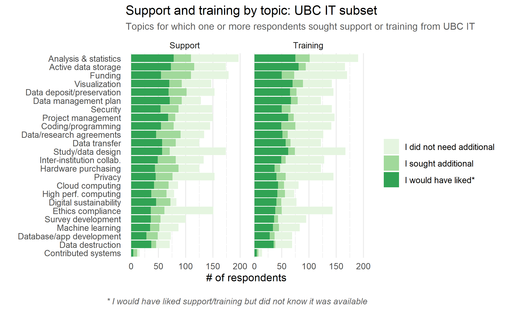
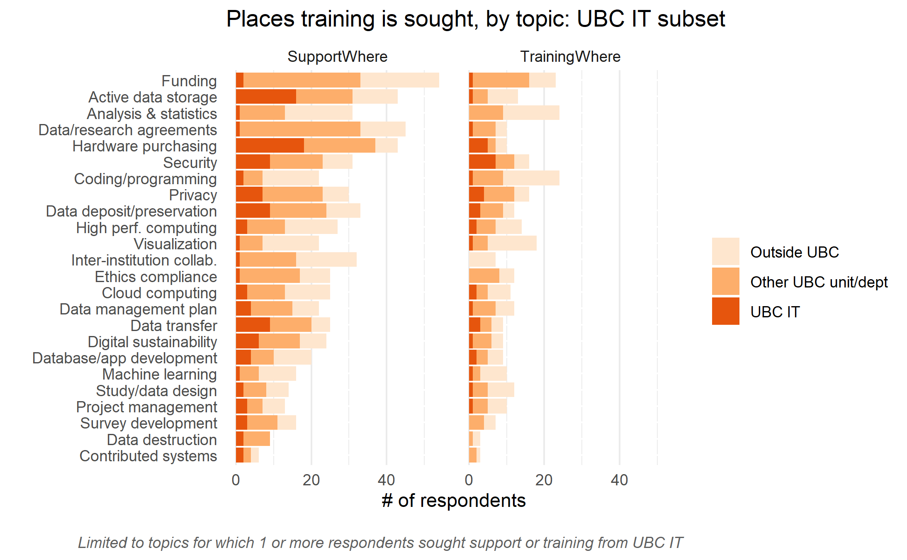

UBC’s department of Information Technology (UBC IT) plays an important role in supporting DRI at UBC, providing the research community with access to infrastructure, software and digital tools, as well as privacy and security to ensure that sensitive research data is properly protected. Given UBC IT’s position within the DRI ecosystem and the number of responses received in the Needs Assessment survey and focus groups, this summary report highlights current areas in which various DRI support and training is sought from UBC IT. Additionally, this report suggests where additional collaboration across departments may strengthen DRI services across UBC as a whole. 
   

### Top Reasons People Come to IT

_Top 3 areas in which **researchers sought support from IT** (Figure X for full details)_

1. Hardware purchasing: 36% of researchers who sought support went to IT 
2. Active data storage: 29% of researchers who sought support went to IT 
3. Security: 25% of researchers who sought support went to IT 

_Top 3 areas in which **researchers sought training from IT** (Figure X for full details)_ 

1. Security: 42% of researchers who sought training went to IT 
2. Hardware purchasing: 42% of researchers who sought training went to IT 
3. Privacy: 21% of researchers who sought training went to IT 

### Key Findings & Recommendations

  <b>Finding 1</b>
   
While UBC IT is a key player in servicing active data storage at UBC, this was a top area in which researchers wanted both training and support, but didn’t know they were available
  
   
   

<b>Recommendation 1</b>
   
 As UBC ARC is also a leader in this area, coordinate services across these units to maximize efforts, resources, and discoverability of services
  

  <b>Finding 2</b>
   
While UBC IT also plays a strong role in servicing retention/deposition/preservation at UBC, this was a top area in which researchers wanted both training and support, but didn’t know they were available
  
   
   

 <b>Recommendation 2</b>
   
  As UBC ARC and UBC Library are also leaders in these areas, coordinate services across these units to maximize efforts, resources, and discoverability of services
  

  <b>Finding 3</b>
   
It was noted in both the survey and focus groups that it is very challenging to find accurate and up-to-date guidance on the intersections of privacy, security, and compliance
  
   
   

<b>Recommendation 3</b>
   
The UBC IT portfolio is responsible for creating the policies and guidelines for researchers to adhere to, but UBC Ethics gets the bulk of questions about compliance.  This gap should be bridged with resources centralized in a single location to support researchers in their ability to conduct research that properly protects research participants
  

## Highlights

