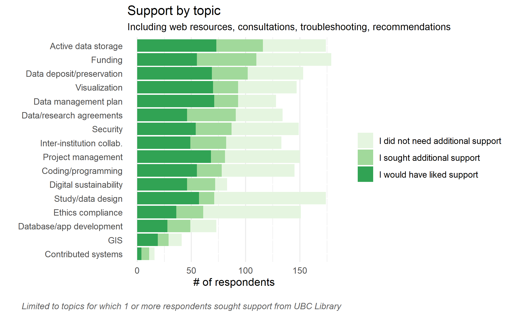
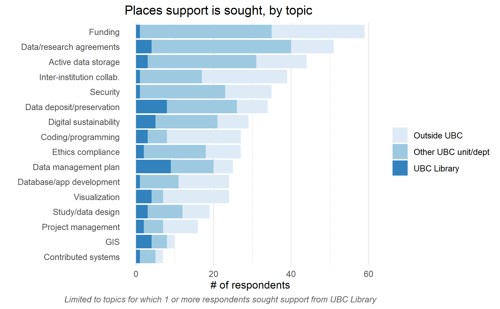
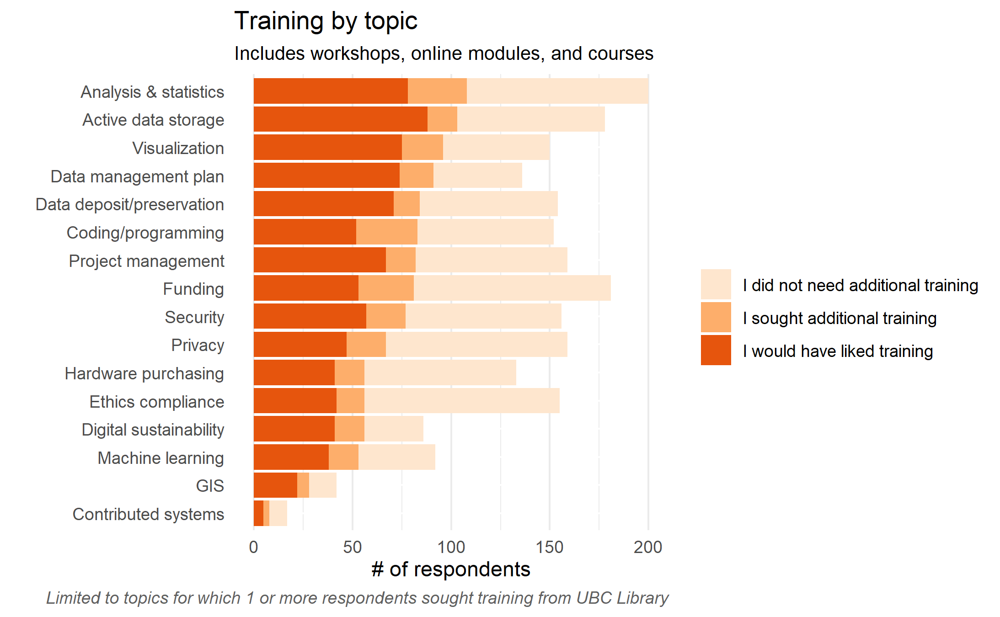
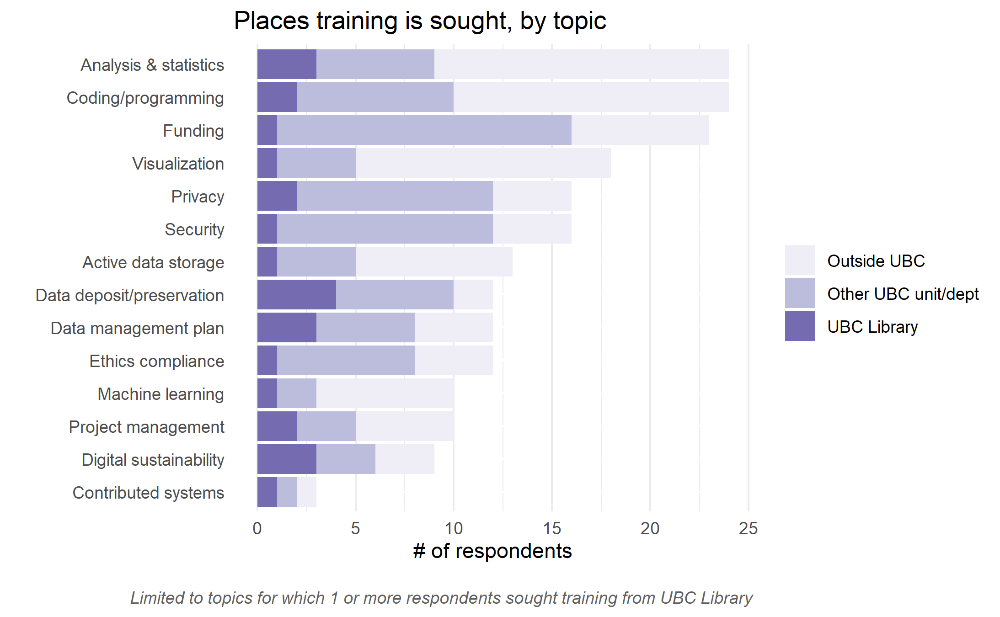

## Executive Summary
For the purpose of this sub-report, the content will be limited to the DRI categories in which researchers sought either training or support from UBC Library.   

### Top Reasons People Come to the Library

_Top 3 areas in which **researchers sought support from the Library** (Figure X for full details)_ 

1. Data management plan (DMP): 24% of researchers who sought support went to Library 
2. Data Retention/deposit/preservation: 16% of researchers who sought support went to Library 
3. Visualization: 14% of researchers who sought support went to Library 

_Top 3 areas in which **researchers sought training from the Library** (Figure X for full details)_ 

1. Data Retention/deposit/preservation: 29% of researchers who sought training went to Library 
2. Data management plan (DMP): 20% of researchers who sought training went to Library 
3. Digital sustainability: 30% of researchers who sought training went to Library 

### Key Findings & Recommendations

**Finding 1:** A significant portion of respondents reported wanting training and support but didn’t know they were available; 

**Recommendation 1:**  Coordinate and strategize communications across portfolios and departments to ensure that researchers are able to easily discover and access services; 

**Finding 2:**  For DRI areas in which researchers turned to Library for training and support, multiple other support groups, including those outside UBC, were also sought; 

**Recommendation 2:** Coordinate services with portfolios and departments that offer similar services to maximize efforts and reduce duplication; 

**Finding 3:** Participants in focus groups noted that finding the right service is challenging. 

**Recommendation 3:** Coordinate across portfolios and departments that provide DRI services to build a central portal for the easy discovery of services. 

## Highlights

