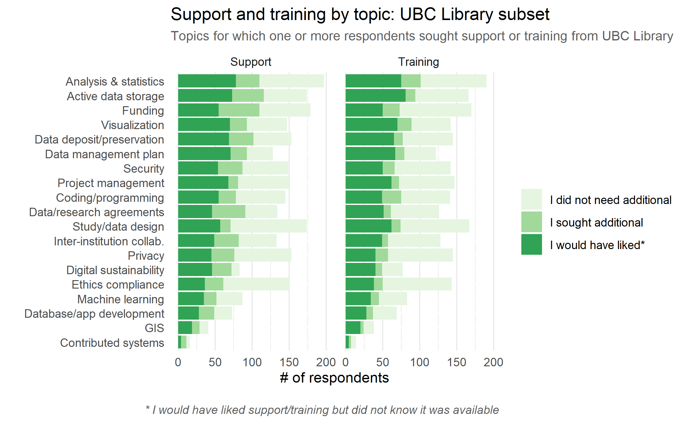
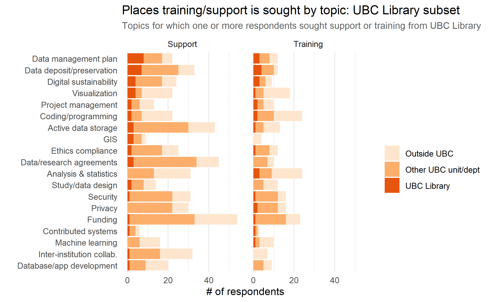

With 13 branches spanning UBC Vancouver, Vancouver General Hospital, and UBC Okanagan, UBC Library supports a range of research activities in diverse and unique contexts. In the context of Digital Research Infrastructure, librarians work with local and national partners to develop access points to research, facilitate deposit of research data, and create training materials to enhance research practices in a digital environment. The library also develops collections and funds platforms that allow researchers to learn about and participate in digital research.

On the Vancouver campus, DRI activities in the realms of RDM, and tools for data visualization, statistical analysis, geospatial inquiries, and text analysis are supported by the Research Commons. On the Okanagan campus, the Centre for Scholarly Communication brings together expertise from the Library, Research Computing, and the Office of Research Services as a single portal to facilitate researcher access to training and support across the full scope of DRI activities queried in the DRI Needs Assessment survey.

## Key Findings & Recommendations

  
<b>Finding 1</b>

  
Many respondents were either unaware of the RDM supports and training available from the lirbary and frequently looked outside the library for RDM supports and training.

  
<b>Recommendation 1</b>
 

  
Why these supports and training are not on the radar of much of the research community warrants investigation into communication strategies and partnerships with units where researchers are seeking supports.

 

  
<b>Finding 2</b>

  
    
UBC Library was frequently the least accessed unit for support across DRI supports and training.

  
<b>Recommendation 2</b>

  
UBC Library provides graduate level training and faculty support across a range of DRI activities. At the same time, there is concern that the training provided by ARC is too advanced. There is particaulr opportunity to harmonize a continuity of training and support across a breadth of skill levels working more closely with ARC.

  

  
## Discussion

Awarenss of training and support, or lack thereof, is a key highlight of this survey. In spite of UBC Library having several communication channels, this survey suggests that the message of the full breadth of services available from UBC Library are not being effectively received by UBC researchers. When asked about this in the focus groups researchers commented on leveraging internal, discipline specficic communication channels for learning about and seeking DRI supports. They also commented on it being challenging to know where to ask within UBC for support, and consequenlty often relying on one person who was helpful in the past to navigate all future questions related to DRI. Lastly, during focus groups researchers noted that having a single point of contact for all inquiries would help to lessen the burden of investigating where to seek support and training.

As a leader in RDM services with a dedicated RDM Librarian and an RDM Team that spans both campuses, alongside national partnerships, the library is in a strong position to support RDM. RDM is a complex undertaking involving data transfer, authorization, ethics, computational hardware and software, taxonomies, coding, and variable level organization of data to name only a few aspects. When done well, RDM leverages expertise from across a breadth of practices. A key element of success is knowing where expertise resides to address each aspect of RDM. Increasing collaborations across units that service training and support for RDM stands to improve practices and increase the scope of researchers availing themselves of the significant infrastcture and resources UBC Library has investeted in to support RDM.

UBC Library, in particular through the Research Commons, provides graduate level training and faculty support across a range of DRI activities, most notably in the realm of digital scholarship, GIS, RDM, and data analysis. Many of these are supported by higher level training and infrastrcuture support by ARC. There is also a large peer and professional training and support network within each discipline, spanning institutions and organizations. During focus groups researchers indicated some ambivilance with regards to whether training and support came from within UBC or not, and if from within UBC if it was centrally provided or unique to their department. They also indicated that they often paid for training outside the institution. From within UBC Library, there is strong potential growth in these offerings. Researchers have expressed concern that the training provided by ARC is too advanced. Leveraging connections into departmental and key non-UBC discipline supports and working alongside ARC there is particaulr opportunity to harmonize a continuity of training and support across a breadth of skill levels to enable well supported and well done computational research at UBC.

Building these communication strategies and collaborations is highly reliant on working relationships between employess, faculty, graduate students, and researchers. However, without executive support to provide guidance and coordination across units and departments any successes remain rooted in individual commitments and approaches. UBC Library stands to support a more robust, integrated DRI service offering if these efforts are provided the needed guidance, coordination, and funding.

## Next Steps

In line with main report, further information gathering is required to address many of the issues highlighted in this survey. Addressing communication challenges would benefit from richer data from participants on information gathering preferences, a key strength UBC Library could contribute to future collective efforts. UBC Library could also play a central role in formalizing a data collection strategy to inform the future of intra-institutional DRI supports and training rooted in connecting support and training providers across both campuses and within specifc departments.

## Top Reasons People Seek Out UBC Library

_Top 3 areas in which **researchers sought support from the Library** (Figure 1 for details)_ 

1. Data management plan (DMP): 24% of researchers who sought support went to Library 
2. Data Retention/deposit/preservation: 16% of researchers who sought support went to Library 
3. Visualization: 14% of researchers who sought support went to Library 

_Top 3 areas in which **researchers sought training from the Library** (Figure 2 for details)_ 

1. Data Retention/deposit/preservation: 29% of researchers who sought training went to Library 
2. Data management plan (DMP): 20% of researchers who sought training went to Library 
3. Digital sustainability: 30% of researchers who sought training went to Library 

 
#### Figure 1

#### Figure 2

